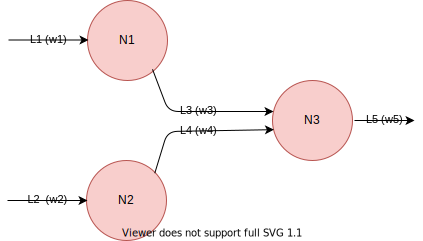

# Logic gate implementation using neural network.
Very simple example where we used ANN to implement logic gates. This looks very childish but, but this simple
implementation is good enough to test the Prof Of Concept (POC) of our ANN. The accompanying code asserts 
our POC by implementing the following.
1. A class which implements a neural network of three neurons, five links organized in architecturally two layers.
2. The binary step function inside a neuron who's outcome is either 0 or 1 depending on whether the input is within the threshold or not.
3. The link, and the weight assigned to the link.
4. Bias (while implementing the not gate).

The diagram of the network is given below.

  
