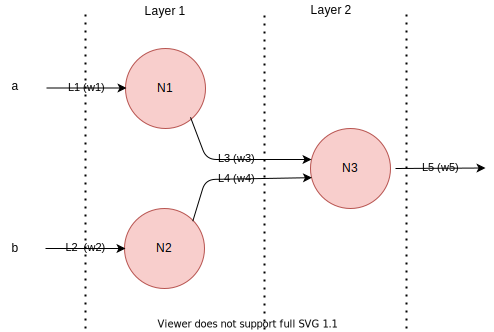
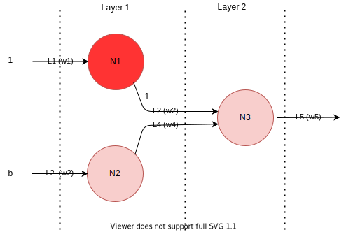

# Logic gate implementation using neural network.
Very simple example where we used ANN to implement logic gates. This looks very childish but, but this simple
implementation is good enough to test the Prof Of Concept (POC) of our ANN. The [accompanying code](./gates.py) asserts 
our POC by implementing the following.
1. A class which implements a neural network of three neurons and five links.
2. They are architecturally organized two layers.
2. The binary step function inside a neuron who's outcome is either 0 or 1 depending on whether the input is within the threshold range or not.
3. The link, and the weight assigned to the link.
4. Bias - the weight of the links between two neurons where one the neuron’s output is always 1.

The diagram of the network is given below.

  
The bias is explained in the below diagram, we used this configuration to implement NOT gate. For not gate input to the neuron N1 is always 1, and so the output, thus link L2 act as bias for the neuron N3. 

